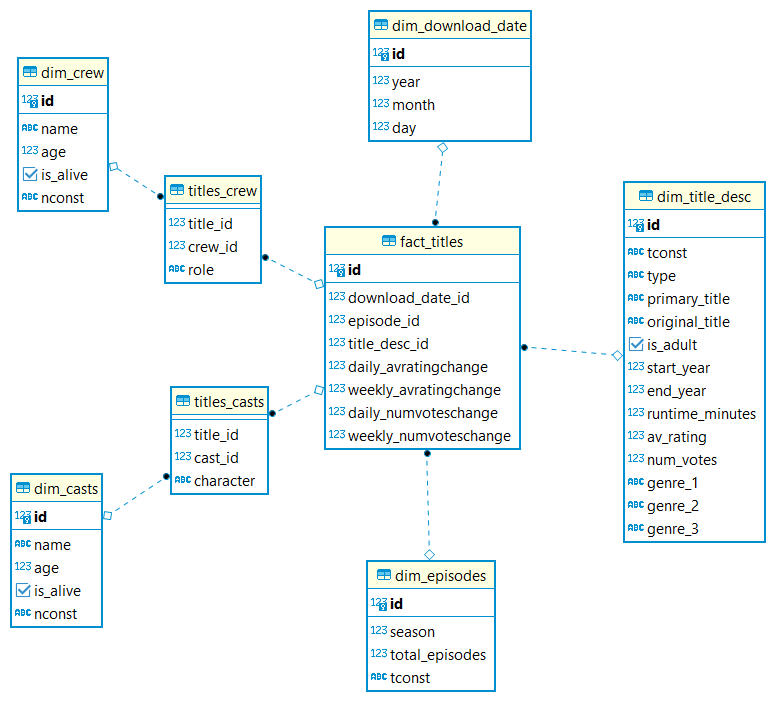
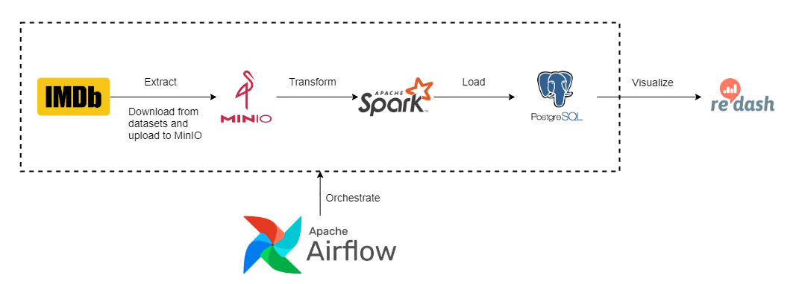
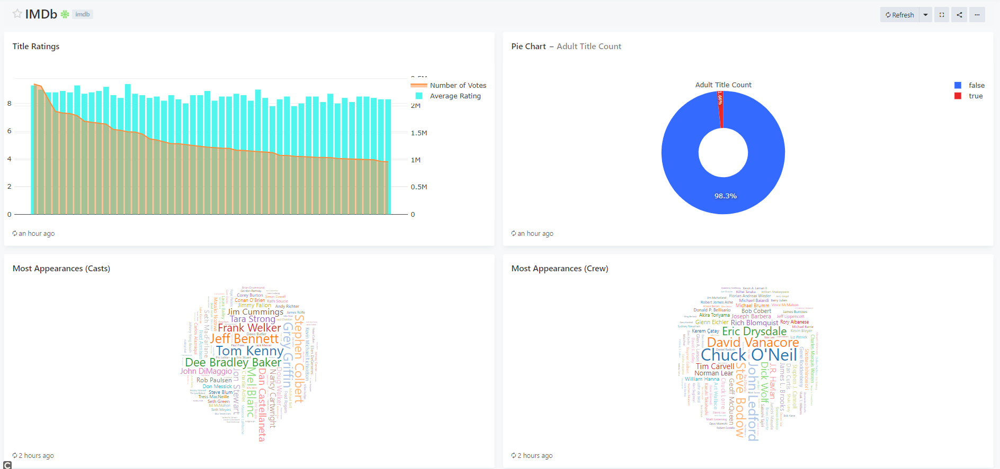
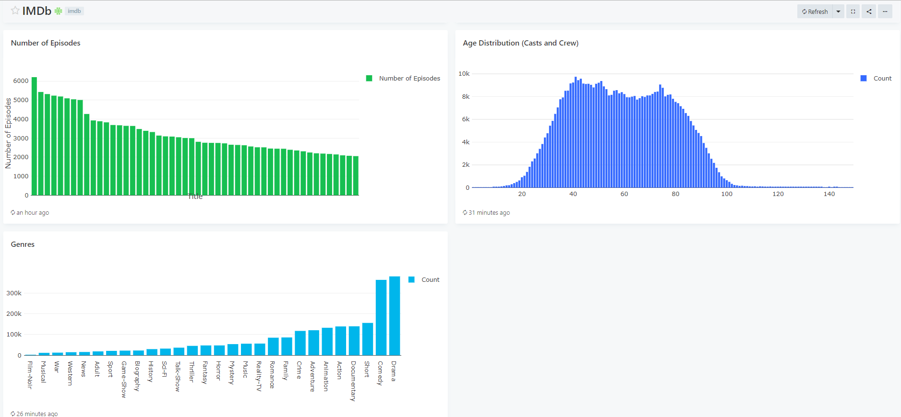

# README

## Introduction
This is a self-learning project on ETL using Spark, Airflow, MinIO and Redash. The IMDb datasets can be found [here](https://datasets.imdbws.com/) and the corresponding documentation can be found [here](https://www.imdb.com/interfaces/). 

After doing some casual browsing as well as data wrangling on the tsv files downloaded from the datasets page, I decided to design the schema as shown below:
<p align="center">
  
</p>

The datasets are downloaded from the datasets page and uploaded to MinIO. After that, I read the tsv files into dataframes and did some processing to fit the schema. The processed data is loaded into a Postgres database. A BI tool like Redash then pulls data out from the database to populate the [dashboard](#dashboard). I used Airflow to automate the ETL process. Following is the high-level overview of the pipeline:\


## Dashboard
A dashboard created using Redash



## Steps
1. Change the values in `airflow/config.json` and `airflow/create_cnx.py`
2. Initialize `Redash` database
> docker-compose run --rm redash create_db
3. Start all services using docker compose
> docker-compose up -d 
4. Visit `Airflow Web UI` at `localhost:8082` and login using
> username: airflow
>
> password: airflow
5. Go to Admin > Variables > Choose File > choose the `config.json` in `airflow` directory > Import Variables
6. Trigger the DAGs that only need to run **ONCE** (create_connections and create_tables)
7. Trigger the `upload_imdb_datasets_minio` DAG and the `imdb_etl` DAG will be triggered after the first one has finished. 
8. Visit `Redash` at `localhost` and set up password
9. Add data source, create queries using the sql statements in `dashboard-queries` folder and create a dashboard from those queries

## Spark standalone on local machine when developing using notebooks
1. Installation
```
sudo apt update  
sudo apt install default-jdk scala git -y
java -version; javac -version; scala -version; git --version
wget https://downloads.apache.org/spark/spark-3.1.2/spark-3.1.2-bin-hadoop3.2.tgz
tar -xvzf spark-*
sudo mv spark-3.1.2-bin-hadoop3.2 /opt/spark
echo "export SPARK_HOME=/opt/spark" >> ~/.profile
echo "export PATH=$PATH:$SPARK_HOME/bin:$SPARK_HOME/sbin" >> ~/.profile
echo "export PYSPARK_PYTHON=/usr/bin/python3" >> ~/.profile
echo "export SPARK_MASTER_WEBUI_PORT=8080" >> ~/.profile
source ~/.profile
```

2. Jar Dependencies
- Go to [Maven Repository](https://mvnrepository.com/) and download all these jar files. Then move all of them to `$SPARK_HOME/jars`. You need to delete the original `guava` jar file in `$SPARK_HOME/jars`

| No. | Jar File            | Version       |
| :-  | :-                  | :-            |
| 1.  | hadoop-aws          | 3.2.0         |
| 2.  | aws-java-sdk-bundle | 1.11.375      |
| 3.  | guava               | 30.1.1-jre    |
| 4.  | jets3t              | 0.9.4         |
| 5.  | postgresql          | 42.2.0        |

3. Start master and worker 
```
$SPARK_HOME/sbin/start-master.sh
$SPARK_HOME/sbin/start-worker.sh spark://<machine_hostname>:7077 
```

4. In the jupyter notebooks, run the following lines to set number of cores and amount of memory to use
```
import os

master = "spark://<machine_hostname>:7077"  
os.environ['PYSPARK_SUBMIT_ARGS'] = f'--master {master} --driver-memory 4g --total-executor-cores 6 --executor-memory 8g --packages org.postgresql:postgresql:42.1.1 pyspark-shell'
```
> **__NOTE:__** Visit `localhost:8080` and you can see the value of your machine hostname

5. Order of execution for notebooks
```
1. download_date.ipynb
2. titles.ipynb
3. episodes.ipynb
4. casts.ipynb
5. crew.ipynb
```

## Todo
- Refactor code to reduce hardcoded stuffs
- unit testing and data validation
- metrics monitoring
