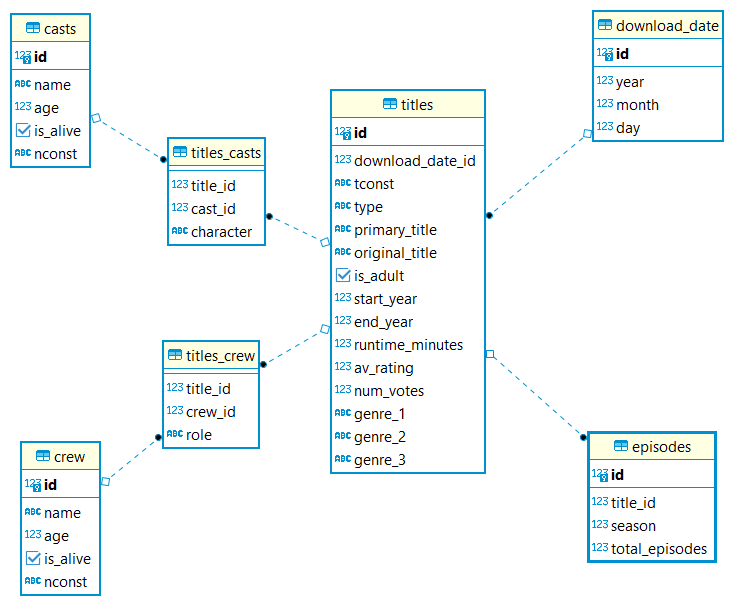

# imdb-etl

## Schema


## Steps
1. Change the values in `airflow/config.json` and `airflow/create_cnx.py`
2. docker-compose up -d 
3. Visit `Airflow Web UI` at `localhost:8082` and login using
> username: airflow
>
> password: airflow
4. Go to Admin > Variables > Choose File > choose the config.json > Import Variables
5. Trigger the DAGs that only need to run **ONCE** (create_connections and create_tables)
6. Trigger the `upload_imdb_datasets_minio` DAG and the `imdb_etl` DAG will be triggered after the first one has finished. 
7. Visit `Grafana Web UI` at `localhost:3000` and login using 
> username: admin
>
> password: password

## Install Spark on local machine
```
sudo apt update  
sudo apt install default-jdk scala git -y
java -version; javac -version; scala -version; git --version
wget https://downloads.apache.org/spark/spark-3.1.2/spark-3.1.2-bin-hadoop3.2.tgz
tar -xvzf spark-*
sudo mv spark-3.1.2-bin-hadoop3.2 /opt/spark
echo "export SPARK_HOME=/opt/spark" >> ~/.profile
echo "export PATH=$PATH:$SPARK_HOME/bin:$SPARK_HOME/sbin" >> ~/.profile
echo "export PYSPARK_PYTHON=/usr/bin/python3" >> ~/.profile
echo "export SPARK_MASTER_WEBUI_PORT=8080" >> ~/.profile
source ~/.profile
```

## Spark Jar Dependencies
- Go to [Maven Repository](https://mvnrepository.com/) and download all these jar files. Then move all of them to `$SPARK_HOME/jars`. You need to delete the original `guava` jar file in `$SPARK_HOME/jars`.
| No. | Jar File            | Version       |
| :-  | :-                  | :-            |
| 1.  | hadoop-aws          | 3.2.0         |
| 2.  | aws-java-sdk-bundle | 1.11.375      |
| 3.  | guava               | 30.1.1-jre    |
| 4.  | jets3t              | 0.9.4         |
| 5.  | postgresql          | 42.2.0        |

## Spark Standalone Cluster
1. Start master and worker 
```
$SPARK_HOME/sbin/start-master.sh
$SPARK_HOME/sbin/start-worker.sh spark://<machine_hostname>:7077 
```

2. In the jupyter notebook, run the following lines to set number of cores and amount of memory to use
```
import os

master = "spark://<machine_hostname>:7077"  
os.environ['PYSPARK_SUBMIT_ARGS'] = f'--master {master} --driver-memory 4g --total-executor-cores 6 --executor-memory 8g --packages org.postgresql:postgresql:42.1.1 pyspark-shell'
```
> **__NOTE:__** Visit `localhost:8080` and you can see the value of your machine hostname

## Order of execution for notebooks
1. download_date.ipynb
2. titles.ipynb
3. episodes.ipynb
4. casts.ipynb
5. crew.ipynb

## Additional Remarks
### Dashboards
- Redash is not flexible - cannot export dashboard, cannot delete queries, cannot resize widgets
> If want to use Redash, before start docker-compose.yaml, do `docker-compose run --rm redash create_db`

### Todo
- Refactor code to reduce hardcoded stuffs
- unit testing and data validation
- metrics monitoring
